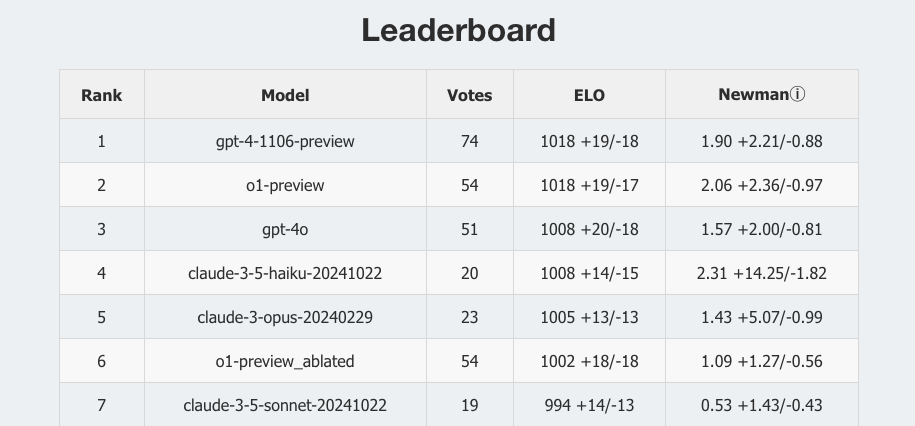

# Humor Arena

[**Latest dataset dump (2025-08-12)**](https://raw.githubusercontent.com/SaveTheRbtz/humor/refs/heads/main/data/humor_arena.choices.20250812.json)

It is common ground that modern LLMs are bad at humor generation. Even top-shelf models tend to memorize and repeat a few simple jokes without any originality.

In our recent paper ["Humor Mechanics: Advancing Humor Generation with Multistep Reasoning"](https://computationalcreativity.net/iccc24/papers/ICCC24_paper_128.pdf) (presented at the International Conference on Computational Creativity 2024), we show that the approach based on multistep reasoning can replicate the creativity process good enough to generate jokes which are on par with human-written jokes (with a top quality subset of "reddit jokes" dataset) according to the blind human labeling results. For more details, you can read the [full paper on arXiv](https://arxiv.org/abs/2405.07280). We also shared our [results and data](https://github.com/altsoph/humor-mechanics) to facilitate future research.

**Now we want to go further:** is there a way to improve reasoning schema? Are some models more potent in terms of humor generation than others? To investigate it, we made this Humor Arena to ask people to [help us with blind side-by-side labeling](https://humor.ph34r.me/arena).

Since our goal is to automate machine understanding of humor, here we demonstrate fully automatic sorting of 2000+ automatically generated jokes, [publishing the top 50 according to machine scores](https://humor.ph34r.me/top-jokes). This is an early beta version and we are working on improving it, with code and algorithms to be published soon. Enjoy!

## Reference

```bibtex
@article{tikhonov2024humor,
  title={Humor Mechanics: Advancing Humor Generation with Multistep Reasoning},
  author={Tikhonov, Alexey and Shtykovskiy, Pavel},
  journal={arXiv preprint arXiv:2405.07280},
  year={2024}
}

@misc{Ivanov2025HumorArena,
  author       = {Alexey Ivanov and Alexey Tikhonov},
  title        = {{humor}: {LLM} Humor Arena},
  year         = {2025},
  howpublished = {\url{https://github.com/SaveTheRbtz/humor}},
  note         = {GitHub repository. Latest commit on main: 43c4d2f (Jul 11, 2025). Accessed: 2026-02-14.}
}
```

# Build dependencies

```
brew install tilt google-cloud-sdk node buf openapi-generator
```

# Dev Environment

```
tilt up
```

# Regenerate protobufs and openapi

```
make generate
```

# build and deploy

```
make deploy
```

